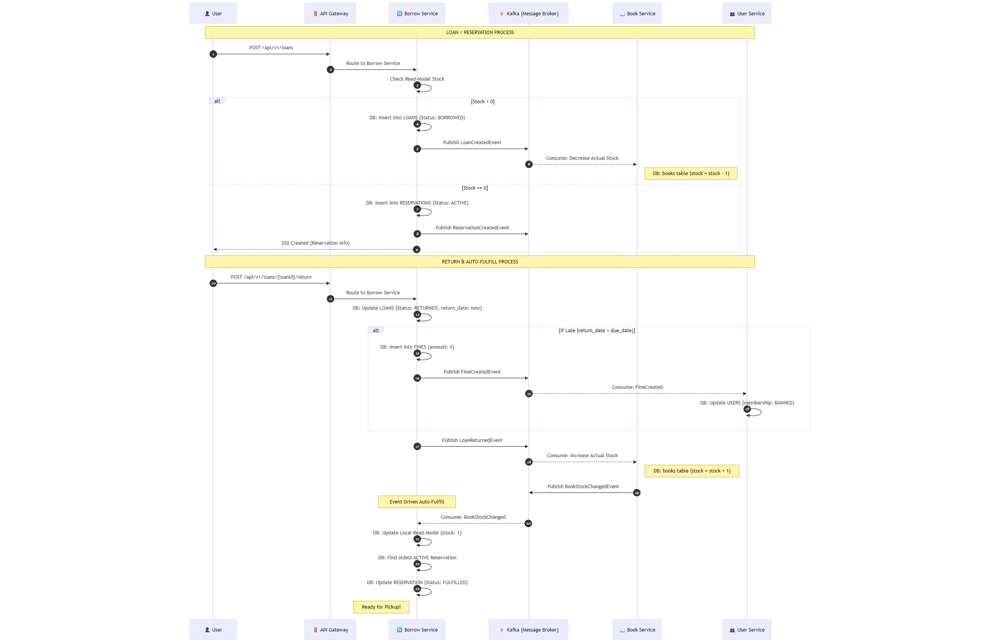

# Kütüphane Yönetim Sistemi (Microservices)

Bu proje, **Domain-Driven Design (DDD)** ve **Command Query Responsibility Segregation (CQRS)** prensipleri üzerine kurulmuş bir mikroservis uygulamasıdır. Servisler arası iletişim ve veri tutarlılığı **Event-Driven Architecture (EDA)** ile sağlanır.

***

## ⚙️ Temel Altyapı ve Teknolojiler

| Bileşen | Amaç | Teknoloji/Desen |
| :--- | :--- | :--- |
| **Servis Keşfi** | Servislerin birbirini bulması. | **Eureka Server** |
| **API Geçidi** | Dış trafiğin yönlendirilmesi. | **API Gateway (Spring Cloud Gateway)** |
| **Mesajlaşma** | Asenkron iletişim ve veri tutarlılığı. | **Apache Kafka** |
| **Güvenilirlik** | Atomik olay yayınlama. | **Transactional Outbox & Inbox** |
| **Veritabanı** | Kalıcı veri depolama. | **PostgreSQL** (JPA/Hibernate) |

***

## 🌐 Servisler ve Sorumluluklar

| Servis Adı | Sorumluluk Alanı | Kritik Aggregate'ler |
| :--- | :--- | :--- |
| **Borrow Service** | Ödünç, İade, Ceza, Rezervasyon işlemleri. | `Loan`, `Fine`, `Reservation` |
| **Book Service** | Kitap ve Envanter (Stok) yönetimi. | `Book` |
| **User Service** (Harici) | Üyelik seviyesi ve durum bilgileri. | - |

***

## 📜 Borrow Service Ana İş Kuralları

1.  **Limit Kontrolü:** **STANDARD** üyeler maksimum 3, **GOLD** üyeler maksimum 5 açık ödünç alabilir.
2.  **Yasaklı İşlem:** **BANNED** statüsündeki üyeler ödünç veya rezervasyon yapamaz.
3.  **Ceza Engeli:** Ödenmemiş **`Fine`** (ceza) kaydı varsa yeni ödünç alamaz.
4.  **Stok/Rezervasyon:** Kitap stokta varsa (`availableCopies > 0`) ödünç verilir; stok sıfırsa (`availableCopies == 0`) **Rezervasyon** açılır.
5.  **Gecikme Cezası:** İade tarihi (`returnDate`), teslim tarihini (`dueDate`) aşarsa **`Fine`** Aggregate Root'u oluşturulur.
6.  **Stok Güncelleme:** `LoanCreatedEvent` ile stok artar (Asenkron, Book Service içinde).

## 🔄 Sistem Akışı
Sistem üzerindeki ödünç alma, rezervasyon ve iade süreçlerinin mikroservisler arasındaki dağıtık yönetimi aşağıdaki diyagramda detaylandırılmıştır: 

>  Bu şema; API Gateway üzerinden gelen isteklerin servisler arası asenkron iletişim (Kafka) ve veri tutarlılığı (Transactional Inbox/Outbox) prensiplerine göre nasıl işlendiğini göstermektedir.
